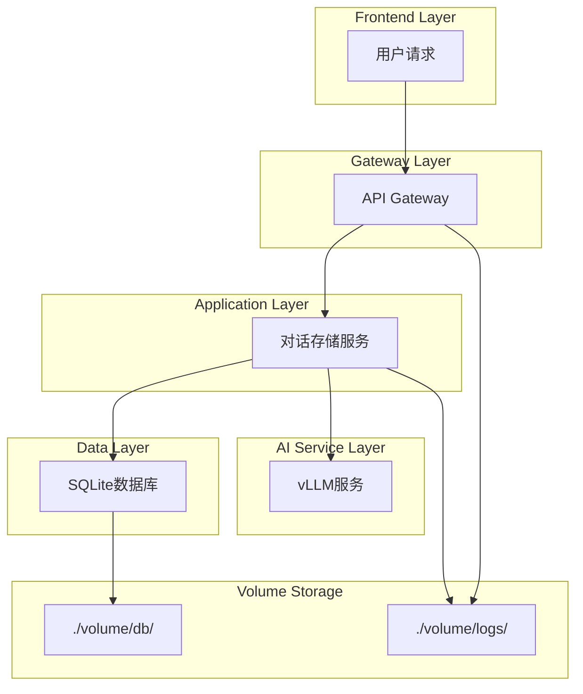
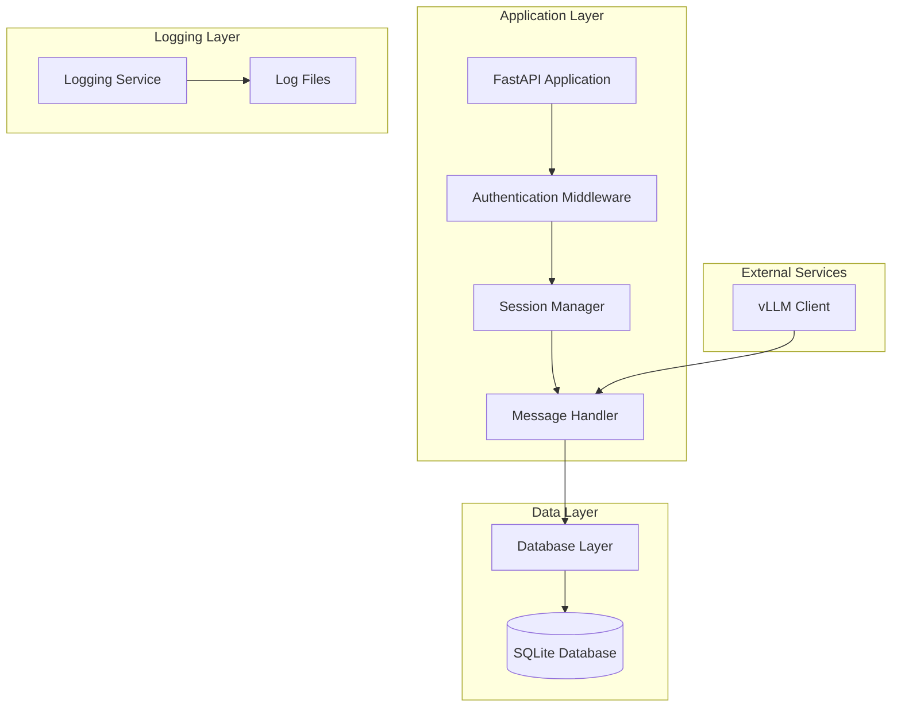
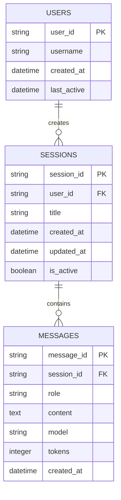

## 1.Architecture design



## 2.Technology Description

- Frontend: API客户端调用
- Backend: FastAPI + SQLite + SQLAlchemy
- Database: SQLite（存储在Docker volume中）
- Container: Docker + Docker Compose
- Storage: 本地volume挂载到./volume目录

## 3.Route definitions

| Route | Purpose |
|-------|----------|
| POST /v1/chat/completions | 增强版对话接口，自动保存对话历史 |
| POST /v1/sessions | 创建新的对话会话 |
| GET /v1/sessions | 获取用户的会话列表 |
| GET /v1/sessions/{session_id}/messages | 获取指定会话的消息历史 |
| DELETE /v1/sessions/{session_id} | 删除指定会话及其消息 |
| GET /v1/users/{user_id}/history | 获取用户的完整对话历史 |

## 4.API definitions

### 4.1 Core API

**会话创建**
```
POST /v1/sessions
```

Request:
| Param Name | Param Type | isRequired | Description |
|------------|------------|------------|-------------|
| user_id | string | true | 用户唯一标识 |
| title | string | false | 会话标题（可选） |

Response:
| Param Name | Param Type | Description |
|------------|------------|-------------|
| session_id | string | 会话唯一ID |
| user_id | string | 用户ID |
| title | string | 会话标题 |
| created_at | string | 创建时间 |

**消息保存**
```
POST /v1/sessions/{session_id}/messages
```

Request:
| Param Name | Param Type | isRequired | Description |
|------------|------------|------------|-------------|
| role | string | true | 消息角色（user/assistant） |
| content | string | true | 消息内容 |
| model | string | false | 使用的模型名称 |
| tokens | integer | false | 消息token数量 |

Response:
| Param Name | Param Type | Description |
|------------|------------|-------------|
| message_id | string | 消息唯一ID |
| session_id | string | 所属会话ID |
| created_at | string | 创建时间 |

**历史查询**
```
GET /v1/sessions/{session_id}/messages
```

Query Parameters:
| Param Name | Param Type | isRequired | Description |
|------------|------------|------------|-------------|
| limit | integer | false | 返回消息数量限制（默认50） |
| offset | integer | false | 分页偏移量（默认0） |

Response:
| Param Name | Param Type | Description |
|------------|------------|-------------|
| messages | array | 消息列表 |
| total | integer | 总消息数 |
| session_info | object | 会话信息 |

## 5.Server architecture diagram



## 6.Data model

### 6.1 Data model definition



### 6.2 Data Definition Language

**用户表 (users)**
```sql
-- 创建用户表
CREATE TABLE users (
    user_id TEXT PRIMARY KEY,
    username TEXT,
    created_at DATETIME DEFAULT CURRENT_TIMESTAMP,
    last_active DATETIME DEFAULT CURRENT_TIMESTAMP
);

-- 创建索引
CREATE INDEX idx_users_last_active ON users(last_active);
```

**会话表 (sessions)**
```sql
-- 创建会话表
CREATE TABLE sessions (
    session_id TEXT PRIMARY KEY,
    user_id TEXT NOT NULL,
    title TEXT DEFAULT 'New Conversation',
    created_at DATETIME DEFAULT CURRENT_TIMESTAMP,
    updated_at DATETIME DEFAULT CURRENT_TIMESTAMP,
    is_active BOOLEAN DEFAULT TRUE,
    FOREIGN KEY (user_id) REFERENCES users(user_id)
);

-- 创建索引
CREATE INDEX idx_sessions_user_id ON sessions(user_id);
CREATE INDEX idx_sessions_created_at ON sessions(created_at DESC);
CREATE INDEX idx_sessions_active ON sessions(is_active, updated_at DESC);
```

**消息表 (messages)**
```sql
-- 创建消息表
CREATE TABLE messages (
    message_id TEXT PRIMARY KEY,
    session_id TEXT NOT NULL,
    role TEXT NOT NULL CHECK (role IN ('user', 'assistant', 'system')),
    content TEXT NOT NULL,
    model TEXT,
    tokens INTEGER DEFAULT 0,
    created_at DATETIME DEFAULT CURRENT_TIMESTAMP,
    FOREIGN KEY (session_id) REFERENCES sessions(session_id) ON DELETE CASCADE
);

-- 创建索引
CREATE INDEX idx_messages_session_id ON messages(session_id);
CREATE INDEX idx_messages_created_at ON messages(created_at);
CREATE INDEX idx_messages_role ON messages(role);
```

**初始化数据**
```sql
-- 插入默认用户（用于个人开发）
INSERT INTO users (user_id, username) 
VALUES ('default_user', 'Developer');

-- 创建示例会话
INSERT INTO sessions (session_id, user_id, title) 
VALUES ('session_001', 'default_user', 'First Conversation');
```

**Docker Volume配置**
```yaml
# 在docker-compose.yml中添加volume配置
volumes:
  - ./volume/db:/app/data
  - ./volume/logs:/app/logs
  - ./volume/models:/app/models
```