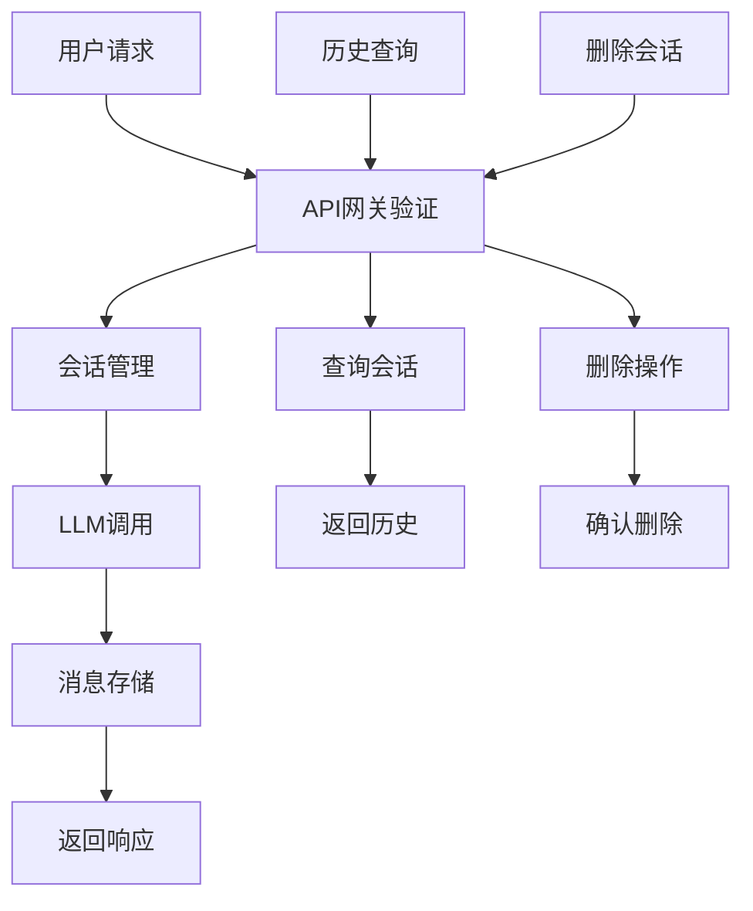

## 1. Product Overview
大模型对话系统对话存储功能，为基于Qwen2.5-7B的个人开发环境提供完整的对话历史管理和用户会话功能。
解决当前系统只有请求日志、缺乏对话内容持久化存储的问题，支持用户会话管理和对话历史查询。

## 2. Core Features

### 2.1 User Roles
由于是个人开发使用，不需要复杂的用户角色区分，采用简单的用户标识机制。

### 2.2 Feature Module
对话存储系统包含以下核心模块：
1. **数据库服务**：SQLite数据库，存储用户、会话和消息数据
2. **对话存储API**：提供对话历史的增删改查接口
3. **会话管理**：用户会话创建、查询和管理功能
4. **数据持久化**：Docker volume配置，数据存储到./volume目录

### 2.3 Page Details

| 模块名称 | 功能名称 | 功能描述 |
|----------|----------|----------|
| 数据库服务 | 用户管理 | 创建和管理用户信息，支持用户ID和基本信息存储 |
| 数据库服务 | 会话管理 | 创建和管理对话会话，每个会话包含唯一ID、用户ID、创建时间等 |
| 数据库服务 | 消息存储 | 存储对话消息，包含消息内容、角色（用户/助手）、时间戳等 |
| 对话存储API | 会话创建 | POST接口创建新的对话会话 |
| 对话存储API | 消息保存 | POST接口保存对话消息到指定会话 |
| 对话存储API | 历史查询 | GET接口查询用户的对话历史和会话列表 |
| 对话存储API | 会话删除 | DELETE接口删除指定会话及其所有消息 |
| 会话管理 | 自动会话 | 在对话请求时自动创建或关联会话 |
| 会话管理 | 会话状态 | 管理会话的活跃状态和过期机制 |
| 数据持久化 | Volume配置 | 配置Docker volume将数据库文件存储到./volume/db目录 |
| 数据持久化 | 日志存储 | 将应用日志存储到./volume/logs目录 |

## 3. Core Process

**主要用户操作流程：**
1. 用户发起对话请求 → API网关验证 → 创建或获取会话 → 调用LLM → 保存对话记录 → 返回响应
2. 用户查询历史 → API网关验证 → 查询用户会话列表 → 返回历史记录
3. 用户删除会话 → API网关验证 → 删除会话及消息 → 返回确认

## 4. User Interface Design

### 4.1 Design Style
由于主要是API服务，UI设计重点在于：
- 简洁的JSON响应格式
- 清晰的错误信息提示
- 统一的API响应结构
- 详细的日志记录格式

### 4.2 Page Design Overview

| 接口名称 | 响应格式 | 设计要点 |
|----------|----------|----------|
| 会话创建 | JSON格式 | 返回会话ID、创建时间、用户ID等关键信息 |
| 消息保存 | JSON格式 | 确认消息保存状态，返回消息ID |
| 历史查询 | JSON格式 | 分页显示，包含会话列表和消息详情 |
| 错误响应 | JSON格式 | 统一错误码和错误信息格式 |

### 4.3 Responsiveness
主要为API服务，重点关注响应速度和数据一致性，支持并发请求处理。